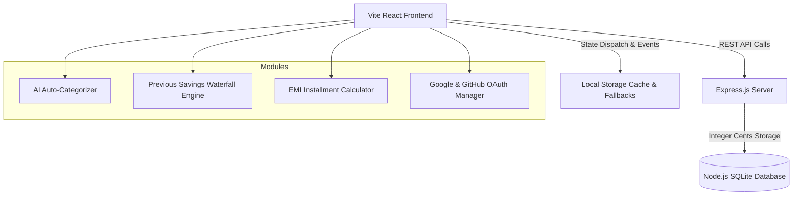

<div align="center">

# 💎 SpendWise - Personal Expense Tracker

  <p align="center">
    <strong>A Next-Generation Personal Finance Dashboard with AI Auto-Categorization, Previous Savings Waterfall Allocation & EMI Management</strong>
  </p>

  <p align="center">
    <a href="#-key-features">Key Features</a> •
    <a href="#-live-interactive-demo--walkthrough">Interactive Features</a> •
    <a href="#%EF%B8%8F-tech-stack">Tech Stack</a> •
    <a href="#-getting-started">Getting Started</a> •
    <a href="#-api-documentation">API Docs</a> •
    <a href="#-license">License</a>
  </p>

  <div>
    
    
    
    
    
    
  </div>

  <br />

</div>

---

## 🌟 Overview

**SpendWise** is a full-featured, privacy-focused personal finance and expense tracking application built for seamless budget management, automated recurring income/expenses, multi-currency support, and intelligent savings goals allocation.

Designed with **Vanilla CSS & Tailwind utility aesthetics**, dark/light mode toggles, and responsive micro-interactions, SpendWise helps users master their cash flow with effortless ease.

---

## ✨ Key Features

### 🤖 1. AI Auto-Categorization Engine
- Type any item description (e.g. *"biryani with friends"*, *"uber ride to airport"*, *"netflix monthly"*).
- The built-in semantic keyword predictor automatically categorizes expenses (**Food**, **Transport**, **Entertainment**, **Shopping**, **Utilities**, **Health**, **EMI**) with a visual `✨ Auto-categorized` badge.

<details>
<summary>🔍 <strong>View Categorization Rules & Supported Keywords</strong></summary>

<br />

| Category | Sample Trigger Keywords |
| :--- | :--- |
| **🍔 Food** | `biryani`, `pizza`, `burger`, `coffee`, `zomato`, `swiggy`, `groceries`, `starbucks`, `cafe` |
| **🚗 Transport** | `uber`, `ola`, `rapido`, `cab`, `metro`, `petrol`, `diesel`, `flight`, `toll`, `train` |
| **🎬 Entertainment** | `movie`, `cinema`, `netflix`, `spotify`, `prime`, `hotstar`, `game`, `pvr`, `concert` |
| **🛍️ Shopping** | `amazon`, `flipkart`, `myntra`, `clothes`, `shoes`, `laptop`, `phone`, `gadget`, `furniture` |
| **⚡ Utilities** | `electricity`, `water`, `wifi`, `broadband`, `recharge`, `rent`, `maid`, `dth` |
| **🏥 Health** | `doctor`, `hospital`, `medicine`, `pharmacy`, `gym`, `fitness`, `clinic`, `blood test` |
| **💳 EMI** | `emi`, `loan`, `mortgage`, `bike loan`, `car loan`, `credit card bill`, `installment` |

</details>

---

### 🌊 2. Previous Savings Waterfall Auto-Allocation Engine
- Unspent balance from past months (`Past Income - Past Expenses`) automatically accumulates into a **Previous Savings Pool**.
- **Waterfall Priority Distribution**:
  1. 🥇 **Primary (High Priority)** goals fill first until reaching 100% target.
  2. 🥈 **Secondary (Medium Priority)** goals receive remaining overflow.
  3. 🥉 **Tertiary (Low Priority)** goals receive any further overflow.
- Displays glowing **Goal Reached!** trophy badges and auto-allocation breakdowns.

---

### 💳 3. EMI & Loan Installments Manager
- Create recurring EMI plans with total duration and monthly installment amounts.
- EMI payments automatically calculate into monthly expenses, balance totals, and bar graph analytics.
- Convenient quick-actions directly from the Dashboard and Sidebar navigation.

---

### 📊 4. Real-time Bar Graphs & Analytics
- **Income vs Expenses Graph**: Real-time month-by-month financial health visualizer powered by Recharts.
- Adding historical income (e.g. for July or June) instantly updates the green income bar for that exact month.
- Budget spending limits isolate expenses to the current month to prevent historical overflow.

---

### 🔐 5. Multi-Provider Authentication (Google & GitHub)
- **Google Identity Services (GSI)**: Integrated 1-Tap account detection and official Google Auth popup modal.
- **GitHub OAuth**: Integrated 1-Click active user detection (`vastav0614`) and official GitHub login authorization.
- **Password Toggle**: Password fields include `Eye` / `EyeOff` show/hide toggles.

---

### 🌐 6. Multi-Currency & Settings Management
- Automatic currency inferencing from phone number country codes (`+91` ➔ `INR ₹`, `+1` ➔ `USD $`, `+44` ➔ `GBP £`, `+81` ➔ `JPY ¥`, etc.).
- Inline green success notifications without intrusive popups.

---

## 🛠️ Architecture & Data Flow



---

## 💻 Tech Stack

- **Frontend**: React 18, Vite 6, TypeScript, TailwindCSS 3
- **Icons & Visuals**: Lucide React Icons, Framer Motion
- **Charts & Data**: Recharts, Date-fns
- **Backend API**: Node.js, Express.js 4
- **Database**: Built-in Node.js SQLite (`node:sqlite` / `sqlite3`) with integer-cent monetary precision

---

## 🚀 Getting Started

### Prerequisites

- **Node.js**: `v22.5.0` or higher (uses Node's native SQLite driver).

### Installation & Execution

1. **Clone the repository**:
   ```bash
   git clone https://github.com/vastav0614/spend-wise.git
   cd spend-wise
   ```

2. **Install dependencies**:
   ```bash
   npm install
   ```

3. **Configure Environment Variables**:
   Create a `.env` file from the `.env.example` template:
   ```bash
   cp .env.example .env
   ```

4. **Run Development Server** (Runs Frontend on port `3000` & Backend watcher on port `4000` concurrently):
   ```bash
   npm run dev:full
   ```

5. **Open in Browser**:
   Navigate to [http://localhost:3000/](http://localhost:3000/)

---

## 📑 API Documentation

<details>
<summary>📄 <strong>Click to expand REST API Endpoints</strong></summary>

<br />

### 🔑 Authentication
- `POST /api/auth/signup` - Register standard account
- `POST /api/auth/login` - Sign in standard account
- `POST /api/auth/google` - Google GSI OAuth authentication
- `POST /api/auth/github` - GitHub OAuth authentication
- `POST /api/auth/logout` - Invalidate active session

### 💸 Expenses
- `GET /api/expenses` - Retrieve user expenses
- `POST /api/expenses` - Create new expense
- `PUT /api/expenses/:id` - Update expense
- `DELETE /api/expenses/:id` - Remove expense

### 💼 Budgets
- `GET /api/budgets` - Retrieve category monthly budgets
- `POST /api/budgets` - Create or update category budget
- `DELETE /api/budgets/:category` - Remove category budget

### 📈 Income
- `GET /api/income` - Retrieve income entries
- `POST /api/income` - Record new income
- `PUT /api/income/:id` - Update income entry
- `DELETE /api/income/:id` - Delete income entry

### 🎯 Savings Goals
- `GET /api/savings-goals` - Retrieve savings goals
- `POST /api/savings-goals` - Create savings goal
- `PUT /api/savings-goals/:id` - Update goal progress/priority
- `DELETE /api/savings-goals/:id` - Delete savings goal

</details>

---

## 📜 Scripts

| Command | Description |
| :--- | :--- |
| `npm run dev:full` | Launches Vite frontend (`http://localhost:3000`) & Express server (`http://localhost:4000`) concurrently. |
| `npm run build` | Compiles production TypeScript bundle into `/dist`. |
| `npm run lint` | Runs TypeScript type checker (`tsc --noEmit`). |

---

## 🤝 Contributing

Contributions, issues, and feature requests are welcome!  
Feel free to check out the [Issues Page](https://github.com/vastav0614/spend-wise/issues).

---

<div align="center">

### ⭐️ Designed & Developed with ❤️ by [Vastav](https://github.com/vastav0614)

</div>
